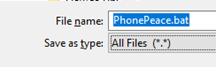

### PhonePeace Software
#### This software is used to transfer phone numbers to and from an Excel spreadsheet and PhonePeace. 
#### Step 1: Instructions to Install the PhonePeace Programmer Driver.
<ul>
  <li>Connect the red programmer (see pictures of programmer below) to your computer with the supplied black cable or supplied adapter and white cable. Click on the <strong>PhonePeace </strong>link above and find the <strong> CDM212364_Setup.zip</strong/> file. Click on <strong>CDM212364_Setup.zip </strong> file. On the right hand side click the <strong>Download</strong> button. Click on the file on the lower left of your Windows Desktop screen, then click on <strong>CDM212364_Setup</strong> and follow the installation instructions. When done reboot your computer. To check the driver has been properly installed, search for Device Manager in Windows lower left search bar, click on Device Manager and look under Ports (COM and LPT). You should see a USB Serial Port installed as shown (Your COM port number may be different). If you click on USB Serial Port you should see the screen showing FTDI This Device is Working Properly.</li>

#### Device Manager Screen 

#### Click on USB Serial Port from above 
#### Step 2: Instructions for Simple Software Installation:
<ul>
  <li>From the README file click on the <strong> PhonePeace</strong> link above. Click on the file <strong>phonepeace.zip</strong></li>
  <li>Click on the download command and click to open the downloaded <strong>phonepeace.zip file </strong></li>
  <li>There are two text Documents in the zip file. Click the file <strong>phonepeace.txt </strong> which will open in Notepad. Click File->Save as and navigate to your <strong>Desktop </strong>. Change the file name to <strong>Phonepeace.bat</strong> and then change the Save as type dropdown to <strong> All Files </strong> as shown below. Be sure the file is on your Desktop. file</ul></li>
  
 #### File Name and File Type   
<ul>
  <li>Repeat the process for the file <strong> PhPrdr.txt </strong></li>
  <li>You should now have two files on your desktop-<strong>phonepeace.bat and PhPrdr.bat </strong>. You can delete the text files you created.</li></ul>
  
#### Step 3: Set Up an Excel or Google Phonebook File:  
  <ul>
  <li>Prepare an Excel or Google Doc's spreadsheet with 2 columns as shown (no numbers or commas in the names field). Save this file on your Desktop <strong><phonebook> be sure to save it as a .CSV file.</strong></ul></li>
  
#### Phonebook Spreadsheet  

#### Step 4: Connect Programmer to PhonePeace
<ul>
  <li>PhonePeace can be shipped with two different types of programmers. It is important you identify which programmer your Phonepeace came with.</li>
    
#### Programmer A  
  
#### Programmer B 
    
  <li>If your PhonePeace came with <strong>Programmer A </strong> plug it into PhonePeace as shown in the picture below with the <strong>Black Component Side facing up.</strong> If your PhonePeace came with <strong> Programmer B plug the programmer in with the Black Component Side facing Down!! </Strong></li>
  <li>Plug the black cable (or white cable with adapter) into one end of the programmer and plug the other end into your computer</li>
  
 #### Plug PhonePeace Programmer into PhonePeace  
  
#### Step 5: Programming PhonePeace and Reading PhonePeace Memory
  <ul>
  <li>Click on the <strong>PhonePeace.bat </strong> icon on the desktop. The program will run automatically, don't press any keys. The lights on the programmer will flash. You will see a screen like below with the numbers and names displayed.
    <strong> Be sure to press Enter when done. </strong> Press the <strong>List </strong> key and <strong>Rev </strong> key on PhonePeace to confirm programming. Programming is now complete. If you do not see this screen or the screen flashes on and disappears, see the troubleshooting instructions. </li></ul>
    
#### PhonePeace Screen During Programming 
   <ul> 
    <li>To read data from the PhonePeace memory click the <strong>PhPrdr.bat file</strong> (don't press any buttons. When the PhonePeace display turns off, wait a few seconts and then press and hold the <strong>Prog </strong> button on the Unit for a few seconds. You will see a file PhPMEM.txt show up on your desktop with all the numbers in memory as shown below. If you want to <strong> erase the memory, press and hold the Prog key for 7 seconds until you see CLEARING on the display</strong></li></ul>
     
 #### PHPMEM.txt file That Will Be on Your Desktop  
  
   
 #### Troubleshooting: If you click on the <strong>phonepeace.bat</strong> icon and nothing happens or the display appears and disappears:      
   <ul>
    <li>Make sure the cables from the computer to the programmer are tightly prugged in and the programmer is plugged into PhonePeace and the computer.</li>
     <li>Make sure the driver is installed by rechecking <strong>Step 1 above</li>
       <li> Make sure the <PhonePeace.bat PhPRdr.bat and phonebook.csv files are all on the Desktop</strong>
     <li>Make sure the phonepeace excel file is saved as a <strong>.CSV file </strong><li>
     <li>If you see "Unable to Open COM Port" and you have verified the driver install, reboot your computer</li>
     <li>If none of these suggestions works please email <strong>sales@myphonepeace.com or call tech support at 734-822-0950 </strong><li>
  
  
  <li>From the README file click on the <strong>PhonePeace </strong>link above to see the <strong>phonepeace.nam file</strong> Click on the file <strong>phonepeacenam.exe</strong></li>
    <li>On the right hand side of the screen click the download button</li>
  <li>You will get a message <em>phonepeacenam.exe is not commonly downloaded and may be dangerous</em> Click on the up arrow and select <strong>keep</strong>. This software has been virus checked by Microsoft Defender, Norton, amd McAfee and is virus free (See Windows Defender and Norton File summary). If you are not comfortable with this please contact the manufacturer 734-822-0950 for a workaround.
  <li>Find <strong>phonepeacenam.exe</strong> in the Downloads file on your computer and copy it to your desktop</li>
  <li>Repeat this process for <strong>PhPReader.exe</strong></li>
  <li>Open a blank Excel or Google Docs spreadsheet. In the first column put the 10 digit phone number (do not use a '1' in front of the number. In the second column put names. <strong>Do not use numbers or commas in the names field!</strong>. Save the Excel or Google Doc's file with the name <strong>phonebook</strong> on your desktop. Be sure to save it in .CSV format. You should now have a file phonebook.csv on your desktop.</li>
  </ul>
  <ul>
      <li> For more information and how to use the software refer to the <Strong>How to Install PhonePeace Software</strong> at www.myphonepeace.com/FAQ</li>
